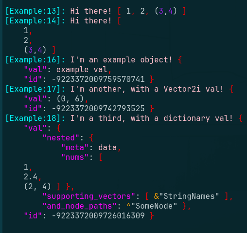

# Log.gd, a Godot pretty printer


> Coming soon to the Godot Asset Library!

### Quick Overview

Log.gd provides static functions for printing colorized output. These
are intended as drop-in replacements for `print(...)`.

- `Log.pr(...)` - pretty print args in one line
- `Log.prn(...)` - the same, but with newlines

This is very useful while developing, because your printed output is much more readable.

The colorized output really shines when showing nested data structures (`Arrays`
and `Dictionaries`), but it's also very useful for other gdscript primitives,
like `Vectors`, `NodePaths`, and `StringNames`. Support for more types is easily
added, feel free to create an issue!

You can opt-in to pretty-printing in your classes by implementing
`to_printable()`, which Log will pickup via duck-typing.

```gdscript
class_name ExampleClass

func to_printable():
    return {val=12}

func _ready():_
    Log.pr(self) # colorized `{"val": 12}`
```


## Example script and output

Checkout [src/Example.gd](src/Example.gd) for this code.

`Log.pr()` colorizes and prints the passed data structures.


`Log.pr()` should Just Work in most (all?) cases

You can opt-in to pretty printing in your objects by implementing
`to_printable()`,
which gets picked up by Log's static method via duck-typing.



This makes dictionaries and arrays much more readable at a glance, which speeds
up debugging and reduces eye-strain.

## godot printing resources

- RichTextLabel docs with lists of bbcode tags:
  https://docs.godotengine.org/en/stable/tutorials/ui/bbcode_in_richtextlabel.html
- print_rich
  supported colors: `black`, `red`, `green`, `yellow`, `blue`, `magenta`, `pink`, `purple`, `cyan`, `white`, `orange`, `gray`
  supported tags: `b`, `i`, `u`, `s`, `indent`, `code`, `url`, `center`, `right`, `color`, `bgcolor`, `fgcolor`

